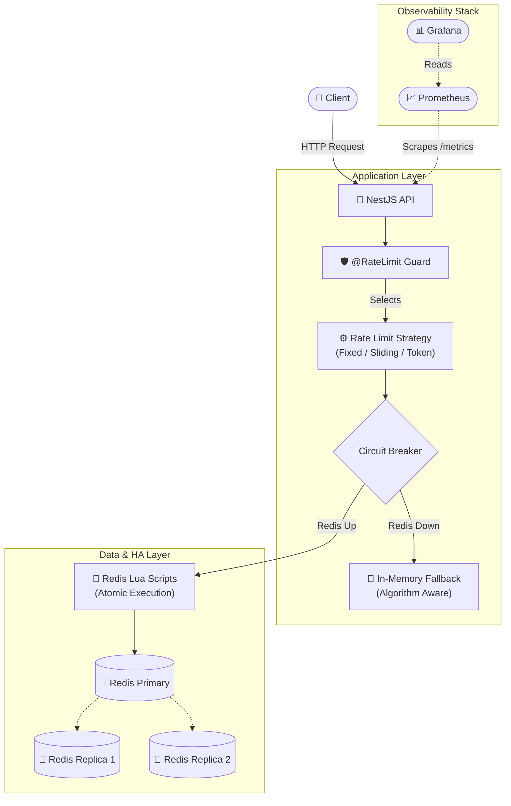
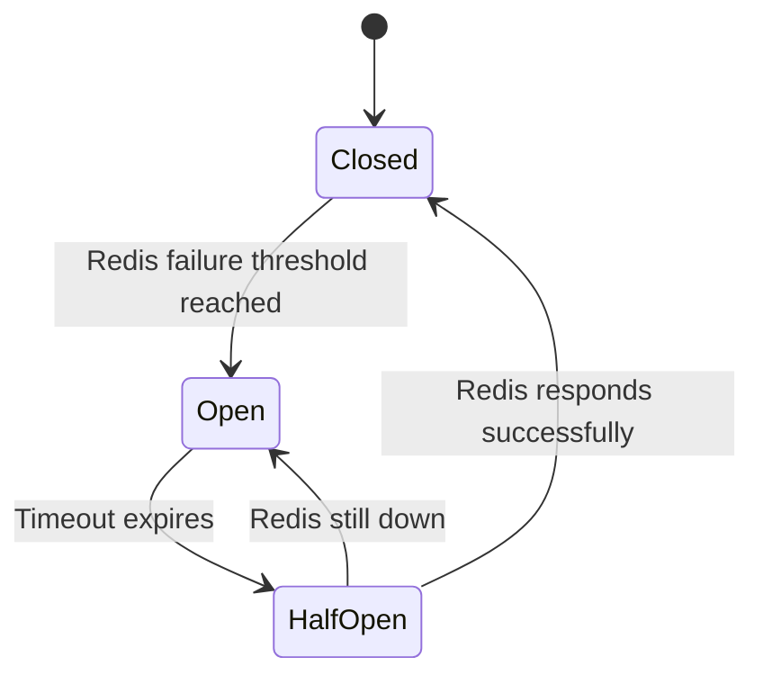

# 🚦 Distributed Rate Limiter

[](https://www.typescriptlang.org/)
[](https://nestjs.com/)
[](https://redis.io/)
[](https://www.docker.com/)
[](LICENSE)

A production-grade, Redis-backed distributed rate limiter built with **NestJS + Fastify**. Supports **Fixed Window**, **Sliding Window**, and **Token Bucket** algorithms enforced atomically via **Redis Lua scripts**, with an algorithm-aware **circuit-breaker fallback**, **Redis Sentinel HA**, and **Prometheus/Grafana** observability. Benchmarked at **p99 < 3ms with 300 concurrent users**.

---

## ✨ Key Features

- **3 Rate-Limiting Algorithms**: Fixed window, sliding window, and token bucket, selectable via a single `@RateLimit()` decorator.
- **Atomic Redis Enforcement**: Each algorithm is implemented as a Lua script for race-condition-free, O(1) atomic operations.
- **Circuit Breaker + Fallback**: In-memory fallback during Redis outages. The fallback is *algorithm-aware*, matching your configured rate-limit strategy.
- **Observability**: Prometheus metrics and a pre-built Grafana dashboard for real-time monitoring.
- **High Availability (HA)**: Redis Sentinel setup (primary + 2 replicas + 3 sentinels) with 30-second auto-failover.
- **Load Testing**: Pre-configured k6 scripts validating burst and sustained traffic patterns.
- **One-Command Deployment**: Fully containerized with Docker Compose (single-node and HA modes).

---

## 🏗️ Architecture



---

## 🔬 Algorithm Comparison

| Algorithm | How It Works | Pros | Cons | Best For |
|---|---|---|---|---|
| **Fixed Window** | Counts requests in fixed time windows. | Simple, low memory footprint. | Bursts at window boundaries can briefly allow 2× the limit. | Simple API rate limiting. |
| **Sliding Window** | Tracks individual request timestamps in a sorted set. | Smooth, precise rate enforcement. | Higher memory usage (stores timestamps). | Strict rate enforcement. |
| **Token Bucket** | Tokens refill at a steady rate; each request consumes a token. | Allows controlled bursts while maintaining average rate. | Slightly more complex state. | APIs needing burst tolerance. |

All three are implemented as **atomic Lua scripts** executed directly on Redis, ensuring thread safety across distributed instances with zero race conditions.

---

## 🛡️ Circuit Breaker

The circuit breaker protects the application from cascading failures during Redis outages:



**Key design decision**: The in-memory fallback is *algorithm-aware*. If your endpoint uses a token bucket strategy, the in-memory fallback will also use token bucket logic (not just a generic counter), ensuring a consistent API contract during outages.

---

## 📡 API Endpoints

| Route | Algorithm | Default Policy |
|---|---|---|
| `GET /fixed` | Fixed Window | `10 requests / 60 seconds` |
| `GET /sliding` | Sliding Window | `10 requests / 60 seconds` |
| `GET /token` | Token Bucket | `10 tokens / 60 seconds` |
| `GET /health` | — | Health check |
| `GET /metrics` | — | Prometheus scrape endpoint |

### Rate-Limit Response Headers
Every rate-limited response includes standard headers:
```http
X-RateLimit-Limit: 10
X-RateLimit-Remaining: 7
X-RateLimit-Reset: 1717891200
Retry-After: 45
```

---

## 🚀 Getting Started

### Prerequisites
- Node.js 20+ & npm
- Docker & Docker Compose

### Option 1: Docker Compose (Recommended)

**Single-node setup** (App + Redis + Prometheus + Grafana):
```bash
docker compose up --build
```
- App: `http://localhost:3000`
- Prometheus: `http://localhost:9090`
- Grafana: `http://localhost:3001` (admin / admin)

**High-Availability setup** (Adds Redis Sentinel cluster):
```bash
docker compose -f docker-compose.ha.yml up --build -d
```
*Note: You can test failover by running `docker compose -f docker-compose.ha.yml stop redis-primary`.*

### Option 2: Run Directly

```bash
npm install
npm run start:dev
```

---

## 📊 Observability & Testing

### Grafana Dashboard
The bundled dashboard (`docker/grafana/`) visualizes:
- Request decisions per second (allowed vs rejected)
- Redis Lua script latency (p95) by algorithm
- Circuit breaker state transitions
- Fallback request rate

### Load Testing with k6
Validate burst behavior, HTTP headers, and sustained traffic patterns:
```bash
# Using Docker (No local installation needed)
docker run --rm --network host \
  -v "$PWD/load-test:/scripts" \
  grafana/k6 run /scripts/rate-limiter.js
```

#### Benchmark: 300 Concurrent Users

A dedicated benchmark (`load-test/benchmark.js`) ramps to **300 concurrent virtual users** and holds sustained load for 60s, measuring rate-limiter decision latency:

```bash
k6 run load-test/benchmark.js
```

Latest local run (single-node Docker Compose, 60s sustained hold, ~100s total, 24,090 requests):

| Metric | Result |
|---|---|
| **Concurrent users (VUs)** | 300 |
| **Requests** | 24,090 (0 failed) |
| **p90 latency** | 2.00 ms |
| **p95 latency** | 2.25 ms |
| **p99 latency** | **2.91 ms** |
| **avg / max latency** | 1.40 ms / 10.43 ms |

> **p99 < 5 ms at 300 concurrent users.** Numbers are from this repo's `load-test/benchmark.js` and will vary with hardware. The default models real users with ~1s think time; set `THINK=0` for a pure throughput/stress run (which saturates a single Node process at much higher RPS and higher tail latency).

---

## 🎯 Design Decisions

| Decision | Rationale |
|---|---|
| **Lua scripts over MULTI/EXEC** | Redis transactions don't support conditional logic. Lua runs atomically on the server. |
| **Fastify over Express** | ~2× higher throughput for the rate-limiter hot path. |
| **Sentinel over Cluster** | Sentinel provides HA for a single dataset without the complexity of hash-slot sharding. |
| **Algorithm-aware fallback** | Preserves the API contract even when Redis goes down. |

---

## 📄 License
This project is licensed under the MIT License — see the [LICENSE](LICENSE) file for details.

---
<p align="center">
  Built by <a href="https://github.com/abinash-thakur">Abinash Thakur</a>
</p>
